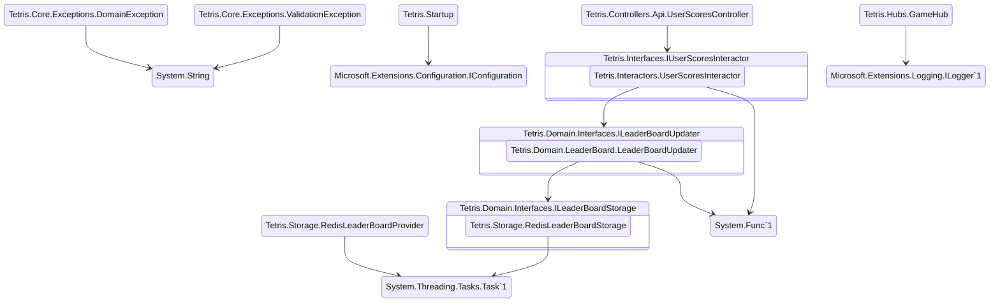

[](https://github.com/stewie1570/tetris/actions/workflows/Merge.yml)
[](https://github.com/stewie1570/tetris/actions/workflows/PR.yml)
======

# A ReactJS SPA with a .NET WebApi/MVC backend

Hosted at:

- <https://stewie1570-tetris.fly.dev>
- <https://tetris-k2l9.onrender.com>
- <http://tetris.hopto.org>  (I'm self hosting this one for fun. It might be running)

## Docker Notes

Build the image:

```terminal
docker build -t tetris .
```

## Config Notes

- If you don't want an error when pausing & loading the score board or want to be able to post a score you'll need to provide a Redis connection string for the `RedisConnectionString` configuration key
- Other optional config keys include `SentryDsn` & `UseBackplane`

## Backend Design (dependency summary)
(via: https://github.com/stewie1570/DIGraph)


